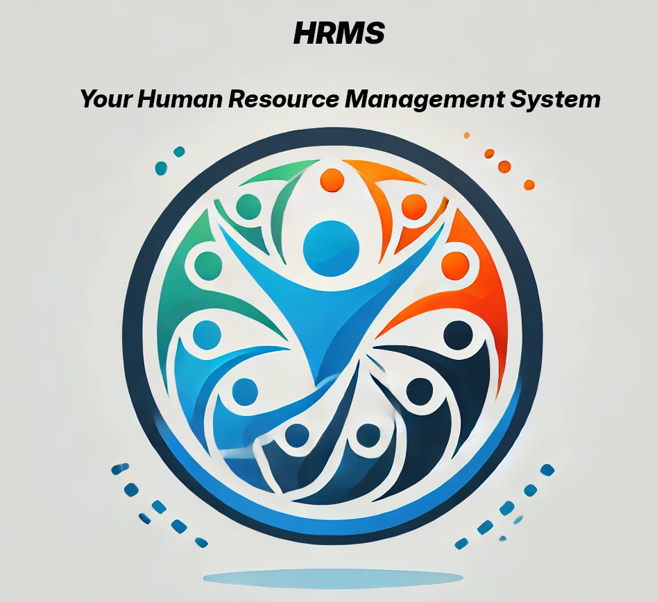

# Human-Resource-Management-System 

## Un gestionale per le Risorse Umane sviluppato in Django 

## Descrizione del Progetto:  
Il progetto consiste nella creazione di un sistema di gestione delle risorse umane (HRMS - Human Resource Management System) per aziende di piccole e medie dimensioni.  
L’applicazione web consentirà di amministrare i dipendenti, registrare presenze, gestire ferie e stipendi, oltre a generare report sulle performance.   
Obiettivi del Progetto   
Centralizzare la gestione del personale.   
Automatizzare la registrazione delle presenze e la gestione delle ferie.   
Fornire un'interfaccia web intuitiva per dipendenti e amministratori.   

### Funzionalità Principali   
## 1. Gestione Dipendenti
Creazione, modifica e rimozione di dipendenti.
Definizione di ruoli aziendali e livelli di accesso.
Archiviazione di documenti (contratti, certificati).

## 2. Presenze e Ferie
Registrazione delle ore di lavoro giornaliere.
Richiesta e approvazione di ferie direttamente dal sito.

## 3. Gestione Buste Paga
Creazione e visualizzazione delle buste paga.
Accesso riservato ai dipendenti per consultare il proprio stipendio.
## 4. Report e Statistiche
Report mensili sulle presenze e le ore lavorate.
Andamento delle ferie e permessi concessi.

## 5. Notifiche e Comunicazioni
Sezione bacheca per comunicazioni aziendali.
Notifiche via email per ferie approvate o nuovi documenti disponibili.

### Tecnologie Utilizzate
Backend: Django   
Frontend: HTML, CSS, JavaScript  
Database: SQLite  
Autenticazione: Django Authentication  

## Contributing

Contributions are welcome! Please feel free to submit a Pull Request.

1. Fork the repository
2. Create your feature branch (`git checkout -b feature/amazing-feature`)
3. Commit your changes (`git commit -m 'Add some amazing feature'`)
4. Push to the branch (`git push origin feature/amazing-feature`)
5. Open a Pull Request

## License

This project is licensed under the MIT License.
